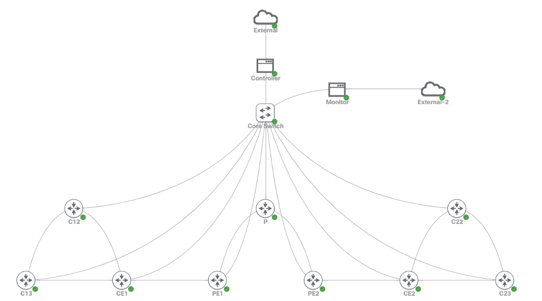

## Network Automation & Configuration Management w/[Ansible](https://github.com/ansible/ansible)

> 2021 Case Study of Computer Networks at Ryerson University

## Briefing
From Ansible:
> Ansible is a radically simple IT automation platform that makes your applications and systems easier to deploy and maintain. Automate everything from code deployment to network configuration to cloud management, in a language that approaches plain English, using SSH, with no agents to install on remote systems.[[1]](#reference)

Here, Ansible is used to implement automation on cisco routers. Collaborate with other netowrk monitor applications, Ansible could be invoked to adjust or restore the infrastructures. 

## Topology


## Environment
### Vitrul Environment
- Cisco Modeling Labs

### Devices
- Cisco Router (IOSv 15.9(3)M2)
- Cisco Switch (IOSv L2 2019)
- Ubuntu Server (20.04 Focal Fossa)

### Ansible
- Ansible 2.9
- Cisco IOS Collection 2.2.0 

## Preparation
### Enable SSH on Routers
Sample:
```script
aaa new-model
aaa authentication login default local

username <username> password <password>
ip domain-name <domain>

crypto key generate rsa modulus <key-length> 

line vty 0 4
privilege level 15
transport input SSH
login authentication default
```
### Install Ansible [[2]](#reference)
> [Ansible 2.9 Installation](https://docs.ansible.com/ansible/2.9/installation_guide/index.html) 

Sample:
```script
sudo apt update
sudo apt install software-properties-common
sudo apt-add-repository --yes --update ppa:ansible/ansible
sudo apt install ansible
```

### Verify Preparation
```script
ansible <hosts> -m ping
```
Sample:
```script
192.168.1.1 | SUCCESS => {
    "ansible_facts": {
        "discovered_interpreter_python": "/usr/bin/python3"
    },
    "changed": false,
    "ping": "pong"
}
```

## More Information
Check out [Ansible Official Documentation](https://docs.ansible.com/ansible/2.9/user_guide/index.html)

## Reference
[1] [Ansible GitHub](https://github.com/ansible/ansible)  
[2] [Ansible 2.9 Installation](https://docs.ansible.com/ansible/2.9/installation_guide/index.html)

## Collaborators
Qianru Shen, Shiyuan (Shaun) Li

## License
[GPL-3.0](https://opensource.org/licenses/GPL-3.0)  
2021 Peiyuan (Patrick) Chen 